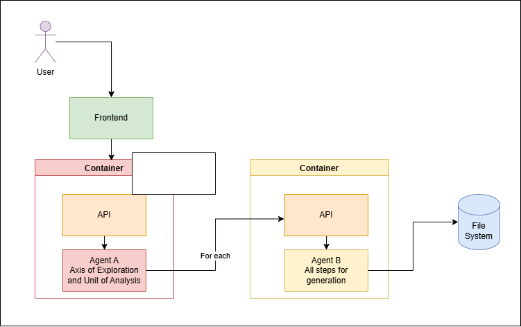

# 1. Create venv (optional but recommended)

python -m venv .venv
source .venv/bin/activate # Windows: .venv\Scripts\activate

# 2. Install deps

pip install -r requirements.txt

# 3. Create .env from example and fill values

cp .env.example .env # or copy manually on Windows and edit

# 4. Run FastAPI (Agent A) on port 8001

uvicorn app.main:app --reload --host 127.0.0.1 --port 8001

